# minitorch

[minitorch](https://github.com/minitorch/minitorch) is a DIY project that implements the core internal concepts underpinning deep learning systems from scratch in native Python. Shout out and thank you to Sasha Rush ([@srush_nlp](https://twitter.com/srush_nlp)) and all contributors of minitorch for creating great open-source learning projects like this one.

## Training classifiers 
Classifiers can be trained using the notebooks in `/notebooks` or through a Streamlit app (see below). The repository defines four example training datasets for training the classifiers. Examples outputs of the training process for each dataset are shown below.

### Simple dataset

    <table>
	    <tr>
    	    <td style="padding:10px">
        	    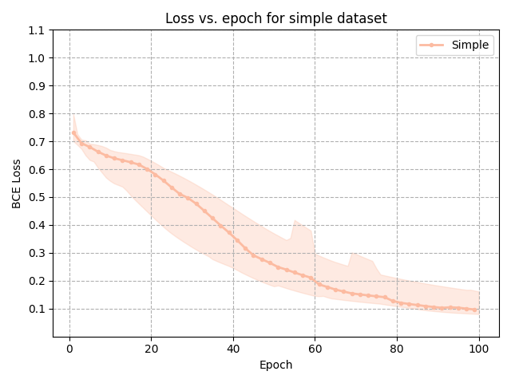
      	    </td>
            <td style="padding:10px">
            	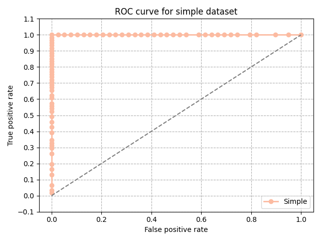
            </td>
            <td style="padding:10px">
            	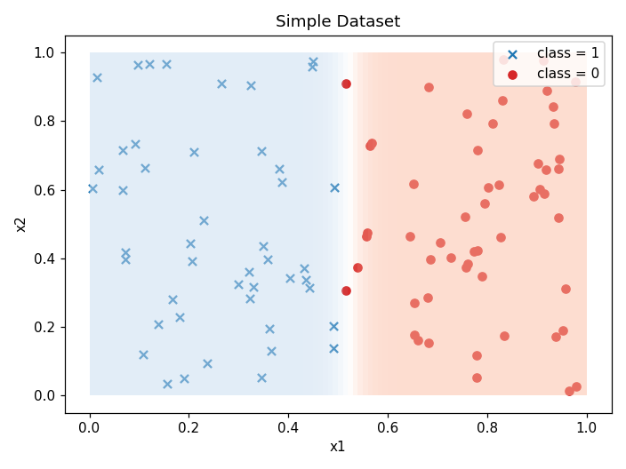
            </td>
        </tr>
    </table>

### Diagonal dataset

    <table>
	    <tr>
    	    <td style="padding:10px">
        	    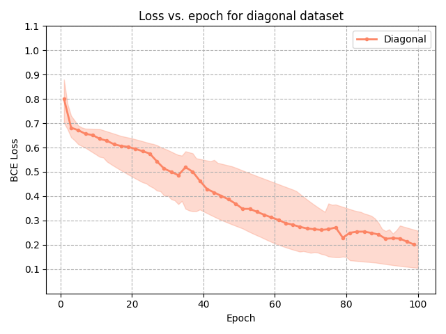
      	    </td>
            <td style="padding:10px">
            	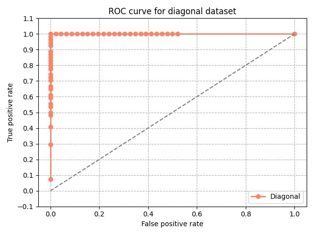
            </td>
            <td style="padding:10px">
            	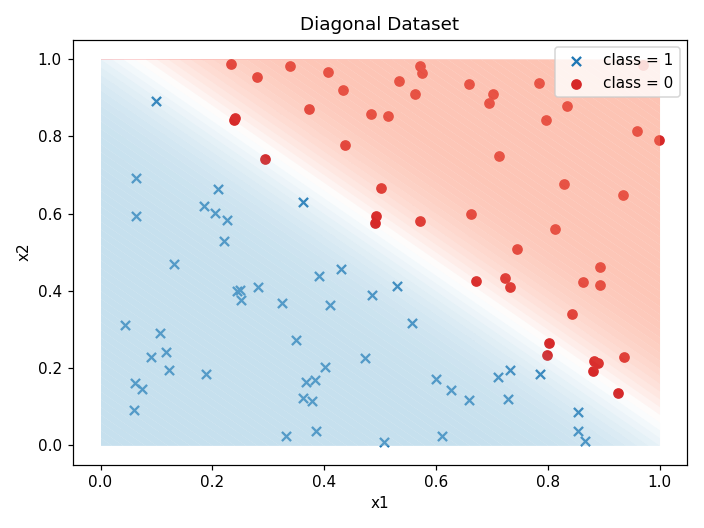
            </td>
        </tr>
    </table>

### Split dataset

    <table>
	    <tr>
    	    <td style="padding:10px">
        	    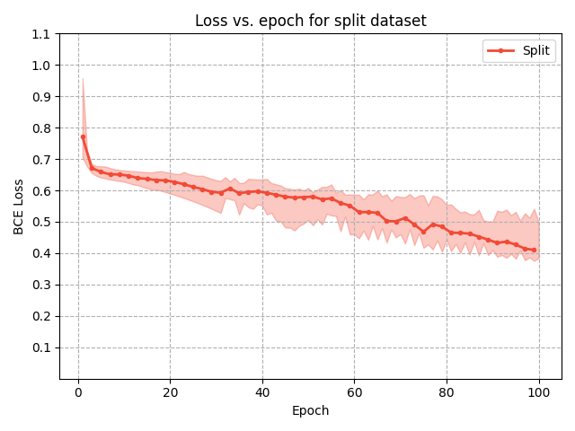
      	    </td>
            <td style="padding:10px">
            	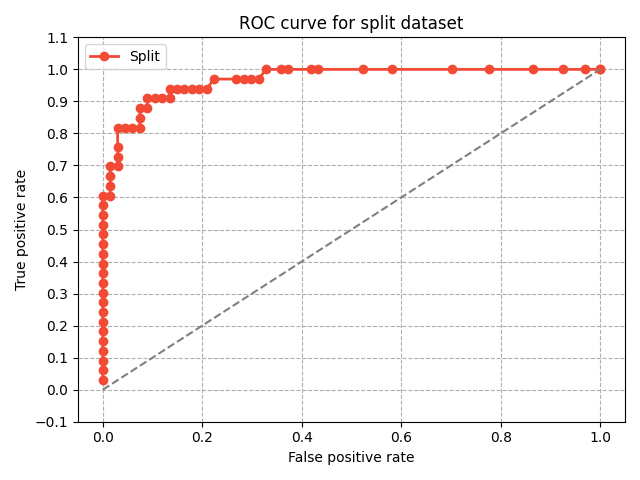
            </td>
            <td style="padding:10px">
            	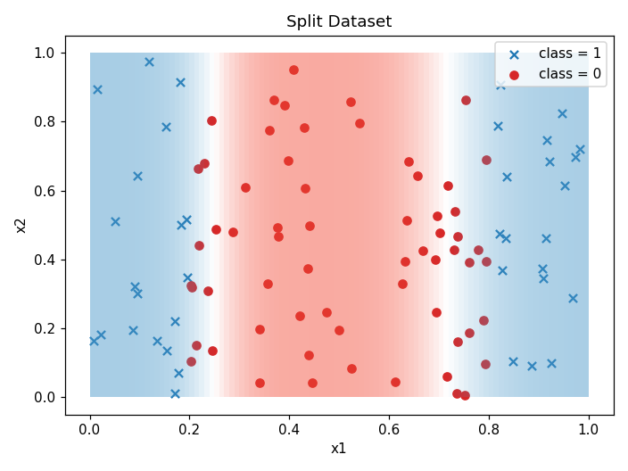
            </td>
        </tr>
    </table>

### XOR dataset

    <table>
	    <tr>
    	    <td style="padding:10px">
        	    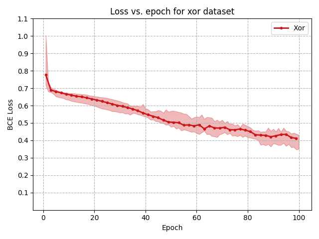
      	    </td>
            <td style="padding:10px">
            	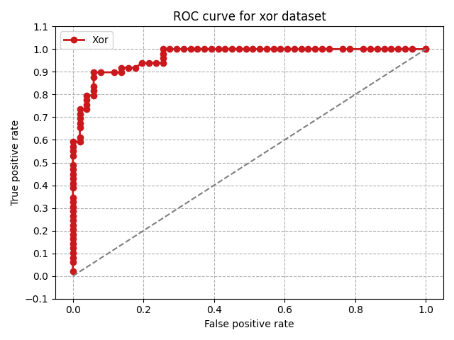
            </td>
            <td style="padding:10px">
            	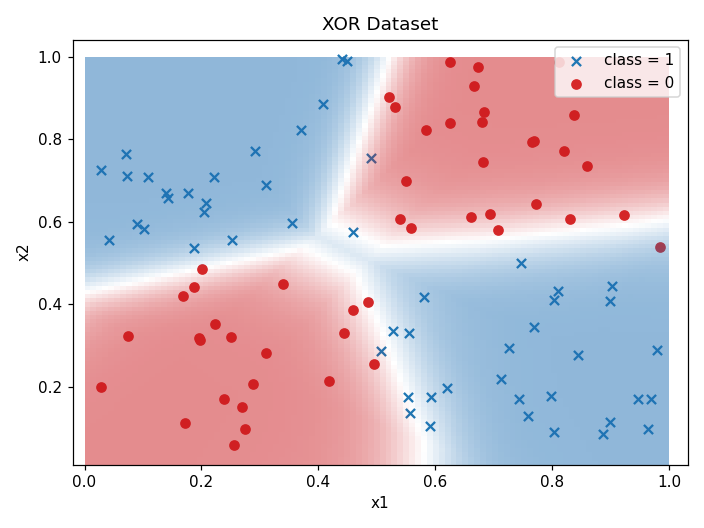
            </td>
        </tr>
    </table>

## Training classifiers through the app
... Coming soon ...

